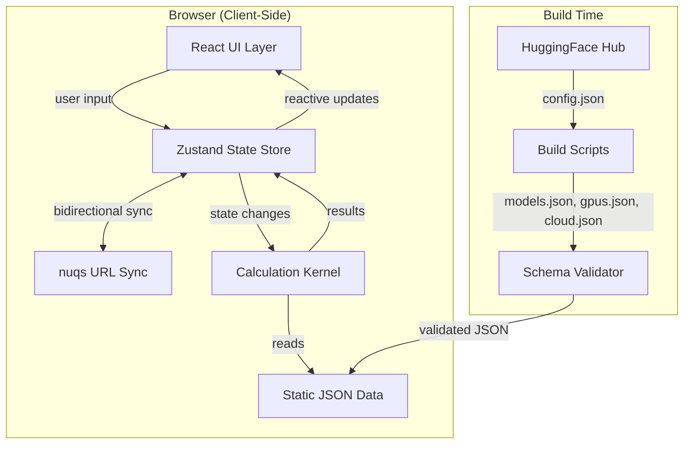
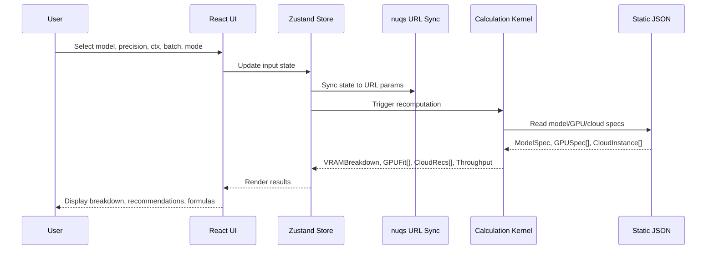
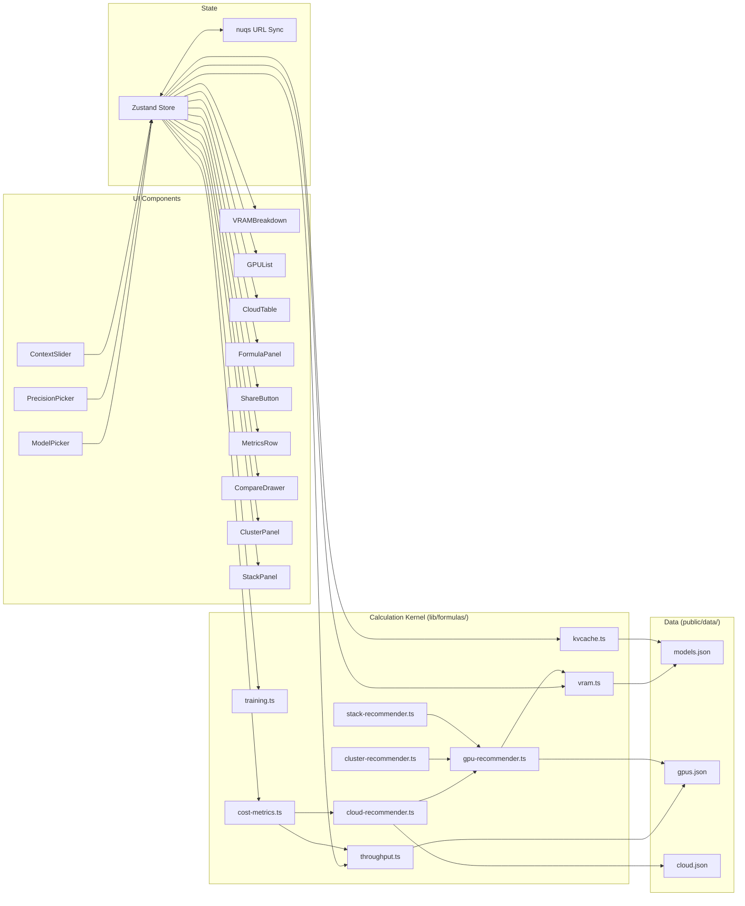

# Design Document: LLM Hardware Calculator

## Overview

The LLM Hardware Calculator is a fully client-side web application that computes hardware requirements, costs, and performance estimates for LLM workloads. The system is built around a pure TypeScript calculation kernel that takes model architecture parameters, precision settings, context length, batch size, and workload mode as inputs, and produces VRAM breakdowns, GPU fit classifications, cloud instance recommendations, and throughput estimates as outputs.

The application ships static JSON databases for models (~40+ LLMs), GPUs (~30+ devices), and cloud instances (~25+ entries), all validated at build time. Every computed output is transparent — users can expand a formula panel to see the exact formula, inputs, and source citation.

Key design decisions:
- **Pure calculation kernel**: All formulas live in `lib/formulas/` as pure functions with no side effects, making them independently testable and composable.
- **Static data, no backend**: Model/GPU/cloud data ships as JSON, generated by build-time scripts. No runtime API calls needed for MVP.
- **URL-as-state**: Calculator state is fully encoded in URL query parameters via `nuqs`, enabling shareable links with zero backend.
- **Zustand for UI state**: Lightweight store that drives reactive recomputation when any input changes.
- **"A serious instrument, not a marketing page"**: Dense, keyboard-first, precision-focused UI built on shadcn/ui + Tailwind CSS with Inter (UI) + JetBrains Mono (numbers) typography.
- **Dark mode as first-class citizen**: Both themes ship day 1, detected via `prefers-color-scheme`, toggled manually, persisted in localStorage with FOUC prevention.
- **Five workload modes**: Inference, Scale, Fine-tune, Train, and Reverse — accessible via underline-style tabs with keyboard shortcuts.

## Architecture

### High-Level Architecture



### Data Flow




### Module Dependency Graph



## Components and Interfaces

### Calculation Kernel

The kernel is a set of pure functions in `lib/formulas/`. Each function takes typed inputs and returns typed outputs with no side effects.

```typescript
// lib/formulas/vram.ts
interface WeightCalcInput {
  numParams: number;        // total parameters
  bytesPerParam: number;    // from precision mapping
}

interface WeightCalcResult {
  weightGB: number;         // rounded to 1 decimal
  rawBytes: number;         // exact byte count
}

function computeWeightMemory(input: WeightCalcInput): WeightCalcResult;

// lib/formulas/kvcache.ts
interface KVCacheInput {
  numLayers: number;
  batchSize: number;
  seqLen: number;
  numKVHeads: number;
  headDim: number;
  bytesPerParam: number;    // KV cache precision (independent of weight precision)
  attentionType: "mha" | "gqa" | "mqa" | "mla";
  mlaCompressedDim?: number;  // d_c for MLA models
}

interface KVCacheResult {
  kvCacheGB: number;        // rounded to 2 decimals
  rawBytes: number;
}

function computeKVCache(input: KVCacheInput): KVCacheResult;

// lib/formulas/training.ts
interface TrainingMemoryInput {
  numParams: number;
  numLayers: number;
  hiddenSize: number;
  numAttentionHeads: number;
  seqLen: number;
  batchSize: number;
  bytesPerParam: number;
  mode: "full" | "lora" | "qlora";
  gradientCheckpointing: boolean;
  loraRank?: number;
  loraTargetModules?: { dIn: number; dOut: number }[];
}

interface TrainingMemoryResult {
  activationsGB: number;
  gradientsGB: number;
  optimizerGB: number;
  totalTrainingGB: number;
}

function computeTrainingMemory(input: TrainingMemoryInput): TrainingMemoryResult;

// lib/formulas/throughput.ts
interface ThroughputInput {
  memoryBandwidthGBs: number;
  activeWeightsGB: number;
  efficiencyFactor: number;   // 0.55–0.95
}

interface ThroughputResult {
  tokensPerSecond: number;    // whole number
}

function computeThroughput(input: ThroughputInput): ThroughputResult;

// lib/formulas/cost-metrics.ts
interface CostMetricsInput {
  tokensPerSecond: number;
  hourlyCloudCost: number;
  contextLength: number;
  activeWeightsGB: number;
  computeTFLOPS: number;
}

interface CostMetricsResult {
  costPerMillionTokens: number;   // USD, 2 decimal places
  timeToFirstTokenMs: number;     // milliseconds, whole number
}

function computeCostMetrics(input: CostMetricsInput): CostMetricsResult;

// lib/formulas/cluster-recommender.ts
interface ClusterRecommendation {
  topology: string;               // e.g., "1× H100 · no parallelism"
  alternativeTopology?: string;   // e.g., "2× RTX 4090 · TP=2"
  framework: string;              // e.g., "vLLM 0.6+"
  frameworkArgs: string;          // e.g., "--quantization gguf --max-model-len 32768"
  alternativeRuntime?: string;    // e.g., "llama.cpp CUDA (-15%)"
}

function recommendCluster(
  totalVRAMGB: number,
  mode: WorkloadMode,
  gpus: GPUSpec[]
): ClusterRecommendation;

// lib/formulas/stack-recommender.ts
interface StackRecommendation {
  os: string;
  driver: string;
  cuda: string;
  pytorch: string;
  container: string;
  monitoring: string;
}

function recommendStack(gpu: GPUSpec, mode: WorkloadMode): StackRecommendation;
```


### VRAM Aggregator

Combines kernel outputs into a total VRAM breakdown:

```typescript
// lib/formulas/vram.ts (aggregation)
interface VRAMBreakdown {
  weightsGB: number;
  kvCacheGB: number;        // inference only
  activationsGB: number;    // training only
  gradientsGB: number;      // training only
  optimizerGB: number;      // training only
  overheadGB: number;       // ~1 GB CUDA context
  totalGB: number;          // sum of all components
}

type WorkloadMode = "inference" | "scale" | "finetune" | "train" | "reverse";

function computeTotalVRAM(
  model: ModelSpec,
  precision: PrecisionConfig,
  kvPrecision: PrecisionConfig,
  contextLength: number,
  batchSize: number,
  mode: WorkloadMode,
  trainingOptions?: TrainingOptions
): VRAMBreakdown;
```

### GPU Recommender

```typescript
// lib/formulas/gpu-recommender.ts
type FitStatus = "green" | "yellow" | "red";

interface GPUFitResult {
  gpu: GPUSpec;
  fitStatus: FitStatus;
  utilizationPercent: number;
  freeVRAMGB: number;
  tokensPerSecond?: number;   // inference mode only
}

interface GPURecommendations {
  allFits: GPUFitResult[];
  budget: GPUFitResult | null;
  balanced: GPUFitResult | null;
  performance: GPUFitResult | null;
}

function classifyGPUFit(totalVRAMGB: number, gpuMemoryGB: number): FitStatus;
function recommendGPUs(totalVRAMGB: number, gpus: GPUSpec[], throughputInput?: ThroughputInput): GPURecommendations;
```

### Cloud Recommender

```typescript
// lib/formulas/cloud-recommender.ts
interface CloudRecommendation {
  instance: CloudInstance;
  totalGPUMemoryGB: number;
  fitStatus: FitStatus;
  onDemandPerHour: number;
  spotPerHour?: number;
  costPerMillionTokens?: number;
  isBestPrice: boolean;
}

function recommendCloudInstances(
  totalVRAMGB: number,
  instances: CloudInstance[],
  gpuDb: GPUSpec[],
  providerFilter?: string,
  regionFilter?: string
): CloudRecommendation[];
```

### URL Serializer

```typescript
// lib/url-serializer.ts
interface CalculatorState {
  model: string;          // model ID
  precision: string;      // precision key
  kvPrecision: string;    // KV cache precision key
  ctx: number;            // context length
  batch: number;          // batch size
  mode: WorkloadMode;     // inference | scale | finetune | train | reverse
  gpu?: string;           // selected GPU for reverse mode
  compare?: string[];     // compare config strings
}

function serializeState(state: CalculatorState): string;   // returns query string
function parseState(queryString: string, modelDb: ModelSpec[]): CalculatorState;
```

### Precision Mapping

```typescript
// lib/formulas/precision.ts
const PRECISION_MAP: Record<string, { bytesPerParam: number; label: string }> = {
  fp32:     { bytesPerParam: 4.0,    label: "FP32" },
  fp16:     { bytesPerParam: 2.0,    label: "FP16" },
  bf16:     { bytesPerParam: 2.0,    label: "BF16" },
  fp8:      { bytesPerParam: 1.0,    label: "FP8" },
  int8:     { bytesPerParam: 1.0,    label: "INT8" },
  int4:     { bytesPerParam: 0.5,    label: "INT4" },
  q4_k_m:   { bytesPerParam: 0.606,  label: "GGUF Q4_K_M" },
  q5_k_m:   { bytesPerParam: 0.711,  label: "GGUF Q5_K_M" },
  q8_0:     { bytesPerParam: 1.0625, label: "GGUF Q8_0" },
};

const KV_PRECISION_MAP: Record<string, { bytesPerParam: number; label: string }> = {
  fp16: { bytesPerParam: 2.0, label: "FP16" },
  int8: { bytesPerParam: 1.0, label: "INT8" },
  q4:   { bytesPerParam: 0.5, label: "Q4" },
};
```

### React Components

| Component | Props | Responsibility |
|---|---|---|
| `<TopBar>` | `theme, onThemeToggle, dataFreshness` | Logo, nav links, data freshness badge, theme/keyboard/github buttons |
| `<ModePicker>` | `value: WorkloadMode, onChange` | Underline-style tabs: Inference, Scale, Fine-tune, Train, Reverse |
| `<ModelPicker>` | `models: ModelSpec[], onSelect` | cmdk-based fuzzy search combobox, ARIA 1.2, family badges, recent selections |
| `<PrecisionPicker>` | `value: string, onChange` | Segmented control with GGUF dropdown expansion, bytes-per-param hint |
| `<KVPrecisionPicker>` | `value: string, onChange` | Segmented control: FP16, INT8, Q4 |
| `<ContextSlider>` | `value, max, onChange` | Log-scale slider, snap to powers of 2, pill value display |
| `<BatchSlider>` | `value, onChange` | Slider with numeric input, range 1–32 |
| `<AdvancedPanel>` | `settings, onChange` | Collapsible panel: framework, overhead, tokenizer |
| `<VRAMBreakdown>` | `breakdown: VRAMBreakdown, gpuRef?: GPUSpec` | Stacked bar (28px), legend grid, total display (48px mono bold) |
| `<MetricsRow>` | `tokPerSec, costPerMTok, ttft` | 3-column metrics: tok/s, $/M tokens, time-to-first-token |
| `<FormulaReveal>` | `formula, inputs, result, source` | Accordion with KaTeX rendering, monospace values |
| `<GPUCard>` | `fit: GPUFitResult` | Fit badge, name/meta/price, utilization bar (4px), stats row (BW, TFLOPS, TDP) |
| `<GPUList>` | `recommendations: GPURecommendations` | Vertical list of GPUCards, recommended card has accent gradient |
| `<CloudTable>` | `instances, onSort, onFilter` | Full-width table with provider logos, interconnect, $/M tok, best-price badge |
| `<CloudRow>` | `rec: CloudRecommendation` | Table row with provider logo, sortable columns |
| `<ClusterPanel>` | `cluster: ClusterRecommendation` | Key-value list: topology, framework, args, alternatives |
| `<StackPanel>` | `stack: StackRecommendation` | Key-value list: OS, driver, CUDA, PyTorch, container, monitoring |
| `<CompareDrawer>` | `configs: CalculatorState[]` | 480px right drawer, up to 3 configs, diff highlighting |
| `<ShareButton>` | `state: CalculatorState` | Copy URL + toast confirmation, icon swap to check |
| `<FormulaPanel>` | `formula, inputs, result, source` | Expandable panel, KaTeX rendering |
| `<EmptyState>` | `icon, title, description, action` | Purposeful empty states with 32px icon |
| `<ErrorState>` | `message, onRetry` | Panel-level error with retry button |

### Zustand Store

```typescript
// store/calculator-store.ts
interface CalculatorStore {
  // Inputs
  selectedModel: ModelSpec | null;
  precision: string;
  kvPrecision: string;
  contextLength: number;
  batchSize: number;
  mode: WorkloadMode;
  trainingOptions: TrainingOptions;
  advancedSettings: AdvancedSettings;

  // Computed (derived)
  breakdown: VRAMBreakdown | null;
  gpuRecommendations: GPURecommendations | null;
  cloudRecommendations: CloudRecommendation[] | null;
  costMetrics: CostMetricsResult | null;
  clusterRecommendation: ClusterRecommendation | null;
  stackRecommendation: StackRecommendation | null;

  // Compare
  compareConfigs: CalculatorState[];

  // Actions
  setModel: (model: ModelSpec) => void;
  setPrecision: (precision: string) => void;
  setKVPrecision: (precision: string) => void;
  setContextLength: (ctx: number) => void;
  setBatchSize: (batch: number) => void;
  setMode: (mode: WorkloadMode) => void;
  addCompareConfig: () => void;
  removeCompareConfig: (index: number) => void;
  recompute: () => void;
}
```


## Data Models

### ModelSpec

```typescript
interface ModelSpec {
  id: string;                          // e.g. "meta-llama/Llama-3.1-8B"
  family: string;                      // "llama" | "mistral" | "qwen" | ...
  displayName: string;
  releaseDate: string;                 // ISO date
  license: string;
  paramsTotal: number;                 // e.g. 8_030_000_000
  paramsActive?: number;               // for MoE models
  architecture: {
    numLayers: number;
    hiddenSize: number;
    intermediateSize: number;
    numAttentionHeads: number;
    numKeyValueHeads: number;          // GQA: fewer than attention heads
    headDim: number;                   // hidden_size / num_attention_heads
    vocabSize: number;
    tieWordEmbeddings: boolean;
    attentionType: "mha" | "gqa" | "mqa" | "mla";
    maxContextLength: number;
    positionalEmbedding: "rope" | "alibi" | "yarn" | "learned";
  };
  moe?: {
    numExperts: number;
    expertsPerToken: number;
    sharedExperts?: number;
  };
  mlaCompressedDim?: number;           // d_c for MLA models (e.g. 512 for DeepSeek-V2)
  trainingTokens?: number;
  notes?: string;
  huggingfaceId?: string;
  apiOnly?: boolean;
}
```

### GPUSpec

```typescript
interface GPUSpec {
  id: string;                          // e.g. "nvidia-h100-sxm-80gb"
  vendor: "nvidia" | "amd" | "apple" | "intel" | "google-tpu";
  name: string;
  category: "consumer" | "workstation" | "datacenter" | "apple-silicon" | "tpu";
  memoryGB: number;
  memoryBandwidthGBs: number;
  flops: {
    fp32: number;                      // TFLOPS
    fp16: number;                      // TFLOPS (or BF16)
    fp8?: number;
    int8: number;                      // TOPS
    sparsity?: boolean;
  };
  tdpWatts: number;
  nvlink?: { perGPU_GBs: number } | null;
  formFactor: "pcie" | "sxm" | "oam" | "integrated" | "mxm";
  msrpUSD?: number;
  streetUSD?: number;
  releaseYear: number;
  notes?: string;
}
```

### CloudInstance

```typescript
interface CloudInstance {
  id: string;                          // e.g. "aws-p5.48xlarge"
  provider: string;                    // "aws" | "azure" | "gcp" | "lambda" | ...
  instanceType: string;
  gpus: { id: string; count: number }[];
  vcpus: number;
  ramGB: number;
  storageGB: number;
  networkGbps: number;
  interconnect?: "nvlink" | "nvswitch" | "infiniband-400" | "infiniband-800" | "rocev2" | "pcie";
  pricing: {
    onDemandUSDPerHour: number;
    spotUSDPerHour?: number;
    reserved1yUSDPerHour?: number;
    reserved3yUSDPerHour?: number;
  };
  regions: string[];
  notes?: string;
  lastPriceUpdate: string;             // ISO date
}
```

### PrecisionConfig

```typescript
interface PrecisionConfig {
  key: string;              // e.g. "q4_k_m"
  label: string;            // e.g. "GGUF Q4_K_M"
  bytesPerParam: number;    // e.g. 0.606
}
```

### CalculatorState (URL-serializable)

```typescript
interface CalculatorState {
  model: string;            // model ID
  precision: string;        // precision key
  kvPrecision: string;      // KV cache precision key
  ctx: number;              // context length
  batch: number;            // batch size
  mode: "inference" | "scale" | "finetune" | "train" | "reverse";
  gpu?: string;             // GPU ID for reverse mode
  compare?: string[];       // encoded compare config strings
}
```

### VRAMBreakdown

```typescript
interface VRAMBreakdown {
  weightsGB: number;
  kvCacheGB: number;
  activationsGB: number;
  gradientsGB: number;
  optimizerGB: number;
  overheadGB: number;
  totalGB: number;
}
```


## Frontend Design System

### Design Philosophy

"A serious instrument, not a marketing page." The audience is developers, ML engineers, and infrastructure architects who value density over whitespace, precision over personality, transparency over magic, and keyboard over mouse. Reference the feel of Linear, Vercel Dashboard, and Radix Primitives docs.

Six design principles:
1. **Information first.** Every pixel earns its place by serving a calculation input, output, or explanation.
2. **One screen, zero scrolling (desktop).** On 1440+ viewports, the primary calculation fits above the fold.
3. **Numbers are hero.** Monospace, tabular figures, high contrast. Numbers never wrap.
4. **Every output explains itself.** Click any number → formula drawer opens.
5. **Dark mode is a first-class citizen**, not an afterthought. Both themes ship day 1.
6. **Graceful degradation, not bloat.** No JavaScript-for-decoration.

### Brand & Visual Identity

- **Name**: LLMcalc
- **Symbol (favicon)**: Stylized GPU die — 3×3 grid of rounded squares, center square in accent color. Renders cleanly at 16×16.
- **Wordmark**: `LLMcalc` in JetBrains Mono SemiBold, `letter-spacing: -0.02em`
- **Voice**: Direct, short sentences. Technical terms used correctly. Second person ("you need..."). Never cheerful, never apologetic. Precise.

### Design Tokens

All tokens are CSS custom properties defined in `:root` with `[data-theme="dark"]` overrides, exposed to Tailwind via `theme.extend`.

#### Spacing Scale (4px base)

| Token | Value | Use |
|---|---|---|
| `--space-0` | 0 | reset |
| `--space-1` | 4px | icon padding, tight gaps |
| `--space-2` | 8px | compact gaps, inline elements |
| `--space-3` | 12px | small card padding |
| `--space-4` | 16px | default gap, card padding |
| `--space-5` | 20px | |
| `--space-6` | 24px | section gaps |
| `--space-8` | 32px | large section gaps |
| `--space-10` | 40px | |
| `--space-12` | 48px | page section gaps |
| `--space-16` | 64px | hero spacing (rare) |

#### Radius Scale

| Token | Value | Use |
|---|---|---|
| `--radius-sm` | 4px | badges, chips, fit badge |
| `--radius-md` | 6px | buttons, inputs (default) |
| `--radius-lg` | 8px | cards, popovers |
| `--radius-xl` | 12px | modals, drawers |
| `--radius-full` | 9999px | pills, avatars |

#### Z-Index Scale

| Token | Value | Use |
|---|---|---|
| `--z-base` | 0 | default |
| `--z-dropdown` | 10 | dropdown menus |
| `--z-sticky` | 20 | sticky top bar, mode tabs |
| `--z-overlay` | 30 | dropdown overlay |
| `--z-drawer` | 40 | compare drawer |
| `--z-modal` | 50 | dialog |
| `--z-popover` | 60 | tooltip on modal |
| `--z-toast` | 70 | toast notifications |

#### Size Tokens

```css
--size-icon-xs: 12px;
--size-icon-sm: 16px;
--size-icon-md: 20px;
--size-icon-lg: 24px;

--size-input-h: 36px;       /* default input height */
--size-input-h-sm: 28px;
--size-input-h-lg: 44px;

--size-button-h: 36px;
--size-button-h-sm: 28px;
--size-button-h-lg: 44px;
```


### Color System

Neutral grayscale dominates (80% of pixels). One chromatic accent (Violet) used sparingly. Semantic colors for fit badges and state. Zero gradients in production UI.

#### Neutral Palette

**Light mode**

| Token | Hex | Purpose |
|---|---|---|
| `--color-bg-base` | `#ffffff` | page background |
| `--color-bg-subtle` | `#fafafa` | striped rows, inactive tabs |
| `--color-bg-muted` | `#f4f4f5` | inputs, cards |
| `--color-bg-emphasis` | `#e4e4e7` | hover, keyboard focus rings |
| `--color-border-subtle` | `#e4e4e7` | default border |
| `--color-border-default` | `#d4d4d8` | stronger border |
| `--color-border-strong` | `#a1a1aa` | focus, active |
| `--color-fg-muted` | `#71717a` | secondary text |
| `--color-fg-default` | `#3f3f46` | body text |
| `--color-fg-primary` | `#18181b` | headings, numbers |
| `--color-fg-inverse` | `#ffffff` | text on accent bg |

**Dark mode**

| Token | Hex | Purpose |
|---|---|---|
| `--color-bg-base` | `#09090b` | page background |
| `--color-bg-subtle` | `#0f0f12` | striped rows |
| `--color-bg-muted` | `#18181b` | inputs, cards |
| `--color-bg-emphasis` | `#27272a` | hover |
| `--color-border-subtle` | `#27272a` | default border |
| `--color-border-default` | `#3f3f46` | stronger border |
| `--color-border-strong` | `#52525b` | focus, active |
| `--color-fg-muted` | `#a1a1aa` | secondary text |
| `--color-fg-default` | `#d4d4d8` | body text |
| `--color-fg-primary` | `#fafafa` | headings, numbers |
| `--color-fg-inverse` | `#09090b` | text on accent bg |

#### Accent — Violet

| Token | Light | Dark |
|---|---|---|
| `--color-accent-subtle` | `#f5f3ff` | `#1e1b2e` |
| `--color-accent-muted` | `#ddd6fe` | `#3b2f66` |
| `--color-accent-default` | `#7c3aed` | `#8b5cf6` |
| `--color-accent-emphasis` | `#6d28d9` | `#a78bfa` |
| `--color-accent-strong` | `#5b21b6` | `#c4b5fd` |

#### Semantic — Fit Status

| Status | Icon | Light | Dark | Meaning |
|---|---|---|---|---|
| fits | check-circle | `#16a34a` | `#22c55e` | ≤80% VRAM utilization |
| tight | alert-triangle | `#ca8a04` | `#eab308` | 80–100% utilization |
| overflow | x-circle | `#dc2626` | `#ef4444` | >100% utilization |
| info | info | `#2563eb` | `#3b82f6` | e.g., "needs TP=2" |

#### Data Visualization Palette

| Role | Light | Dark |
|---|---|---|
| Weights | `#7c3aed` | `#8b5cf6` |
| KV cache | `#0891b2` | `#06b6d4` |
| Activations | `#ca8a04` | `#eab308` |
| Gradients | `#db2777` | `#ec4899` |
| Optimizer | `#ea580c` | `#f97316` |
| Overhead | `#64748b` | `#94a3b8` |
| Free / headroom | `#e4e4e7` | `#27272a` |

Color-blind verified via Deuteranopia, Protanopia, Tritanopia simulators — all series remain distinguishable via hue + luminance separation.

#### Contrast Commitments

- Body text (fg-default on bg-base): ≥ 7.0:1 (AAA)
- UI labels (fg-muted on bg-base): ≥ 4.5:1 (AA)
- Numbers against their row bg: ≥ 7.0:1
- Focus ring: ≥ 3.0:1 against adjacent colors


### Typography

#### Font Families

```css
--font-sans: 'Inter', -apple-system, BlinkMacSystemFont, 'Segoe UI', system-ui, sans-serif;
--font-mono: 'JetBrains Mono', 'SF Mono', 'Fira Code', Consolas, monospace;
```

Inter Variable loaded self-hosted (woff2, `font-display: swap`). JetBrains Mono Variable for numbers, code, formulas.

#### Type Scale

UI defaults to `text-sm` (13px) — denser than marketing sites, correct for a tool.

| Token | Size | Line Height | Use |
|---|---|---|---|
| `text-3xs` | 10px | 14px | micro-labels, superscript |
| `text-2xs` | 11px | 16px | table cells, badges, card titles |
| `text-xs` | 12px | 16px | secondary labels, captions, field labels |
| `text-sm` | 13px | 20px | **UI body default** |
| `text-base` | 14px | 22px | dense UI text |
| `text-md` | 15px | 24px | |
| `text-lg` | 16px | 26px | article body |
| `text-xl` | 18px | 28px | subheads, unit suffix on hero number |
| `text-2xl` | 20px | 28px | card headers |
| `text-3xl` | 24px | 32px | section headers |
| `text-4xl` | 30px | 36px | page titles |
| `text-5xl` | 36px | 40px | number emphasis |
| `text-6xl` | 48px | 52px | VRAM total hero number |

#### Weights

| Weight | Name | Use |
|---|---|---|
| 400 | Regular | body |
| 500 | Medium | UI labels, table headers |
| 600 | SemiBold | headings, buttons, hero numbers |
| 700 | Bold | emphasis |

#### Number Rendering (Critical)

All numeric output must use:
```css
font-family: var(--font-mono);
font-variant-numeric: tabular-nums;
font-feature-settings: "tnum", "cv10";
```

Numbers never wrap; long numbers truncate in their cell and show full value in a tooltip.

**Hero VRAM number**: JetBrains Mono 600, 48px, `letter-spacing: -0.02em`, `color: var(--color-fg-primary)`. Unit suffix ("GB") in 18px muted color, 8px left margin.

### Layout System

#### Breakpoints

| Name | Min width | Design for |
|---|---|---|
| `sm` | 640px | Large phones |
| `md` | 768px | Tablet portrait |
| `lg` | 1024px | Tablet landscape, small laptop |
| `xl` | 1280px | **Primary desktop target** |
| `2xl` | 1536px | Large desktop |
| `3xl` | 1920px | Widescreen |

Mobile-first CSS; base styles are mobile, `md:` and up scale out.

#### Grid

12-column grid. Calculator home uses `max-w-[1760px]` with 24px gutter (desktop), 16px (tablet), stacked (mobile).

**Desktop xl+ (3-column):**
```
[ Inputs: 280px fixed ][ VRAM Breakdown: flex ][ Recommendations: 380px fixed ]
```

**Tablet md (2-column):**
```
[ Inputs: 12 cols ]
[ VRAM Breakdown: 6 cols ][ Recommendations: 6 cols ]
```

**Mobile (stacked):**
```
[ Mode tabs — full width ]
[ Inputs — full width, collapsible ]
[ VRAM Breakdown — full width ]
[ Recommendations — full width, card list ]
```

#### Page Chrome

```
┌─────────────────────────────────────────────────────┐
│ TOP BAR   48px fixed, z-index: 20                    │
│  logo · nav · data-freshness  ·  theme · ⌨ · github  │
├─────────────────────────────────────────────────────┤
│ MODE TABS   48px sticky (top: 48px), z-index: 19    │
│  [Inference] [Scale] [Fine-tune] [Train] [Reverse]   │
│                                    Share | Compare    │
├─────────────────────────────────────────────────────┤
│ MAIN CONTENT                                         │
├─────────────────────────────────────────────────────┤
│ FOOTER  (thin, mono, unobtrusive)                    │
│  version · methodology · github · changelog           │
│  prices refreshed timestamp                           │
└─────────────────────────────────────────────────────┘
```


### Iconography

**Lucide React** — single source, consistent stroke, tree-shakeable. All icons at `strokeWidth={1.75}`.

| Context | Size |
|---|---|
| Inline with text-xs/text-sm | 14px |
| Button / input icon | 16px |
| Card header | 20px |
| Empty state illustration | 32px |

Icon map:

| Concept | Icon |
|---|---|
| Model | `Cpu` |
| GPU | `Microchip` / `CircuitBoard` |
| Cloud | `Cloud` |
| Memory | `MemoryStick` |
| Performance | `Gauge` |
| Cost | `DollarSign` |
| Share | `Share2` |
| Copy | `Copy` / `Check` (state swap) |
| Compare | `ArrowLeftRight` |
| Settings | `Sliders` |
| Formula | `Sigma` / `FunctionSquare` |
| Dark mode | `Moon` / `Sun` |
| Reverse mode | `Repeat` |
| Training | `Dumbbell` / `Flame` |
| Fine-tune | `Wrench` |
| Cluster | `Network` |

### Elevation, Radius, Borders

The app is flat by default; elevation used only for overlays.

| Token | Light | Dark | Use |
|---|---|---|---|
| `--shadow-sm` | `0 1px 2px rgb(0 0 0 / 0.04)` | `0 1px 2px rgb(0 0 0 / 0.5)` | hover lift |
| `--shadow-md` | `0 4px 6px -1px rgb(0 0 0 / 0.06), 0 2px 4px -2px rgb(0 0 0 / 0.04)` | `0 4px 12px rgb(0 0 0 / 0.6)` | dropdown |
| `--shadow-lg` | `0 10px 15px -3px rgb(0 0 0 / 0.08)` | `0 12px 24px rgb(0 0 0 / 0.7)` | modal |
| `--focus-ring` | `0 0 0 2px var(--color-bg-base), 0 0 0 4px var(--color-accent-default)` | same | focus ring |

Borders carry most visual separation: 1px `--color-border-subtle` default, hover → `--color-border-default`.

In dark mode, elevation uses lighter background instead of stronger shadow:
- Surface 0 (page): `#09090b`
- Surface 1 (card): `#0f0f12`
- Surface 2 (popover): `#18181b`
- Surface 3 (modal): `#27272a`

### Motion & Animation

Motion clarifies, never entertains. Max 200ms for any UI state change. Respect `prefers-reduced-motion`.

```css
--ease-out: cubic-bezier(0.16, 1, 0.3, 1);
--ease-in-out: cubic-bezier(0.4, 0, 0.2, 1);
--ease-spring: cubic-bezier(0.34, 1.56, 0.64, 1);   /* drawer open only */

--duration-fast: 120ms;
--duration-base: 160ms;
--duration-slow: 240ms;
```

| Interaction | Duration | Easing |
|---|---|---|
| Button hover | 120ms | out |
| Input focus ring | 120ms | out |
| Tab switch (content fade) | 160ms | out |
| Tooltip show | 120ms delay + 80ms fade | out |
| Dropdown open | 160ms | out |
| Modal open | 200ms bg fade, 240ms content slide | out |
| Drawer open | 240ms | spring |
| VRAM bar segment update | 400ms value tween | in-out |
| Tokens/sec counter update | 500ms number tween | out |

What never animates: layout shifts from data loading, font changes, scroll-triggered animations. Number labels snap immediately; only the bar tweens.


### Component Specifications

All components built on shadcn/ui base, customized per design tokens. Source-owned (copied into repo), not a dependency. Each gets a Storybook story with all variants.

#### Button

Variants: `primary`, `secondary`, `ghost`, `outline`, `destructive`, `link`
Sizes: `sm` (28px), `md` (36px default), `lg` (44px), `icon` (square)

```
primary:     bg=accent-default, fg=white, hover=accent-emphasis
secondary:   bg=bg-muted, fg=fg-primary, border=border-subtle, hover bg=bg-emphasis
ghost:       bg=transparent, hover bg=bg-muted
outline:     bg=transparent, border=border-default, hover border=border-strong
```

States: `:hover`, `:focus-visible` (focus ring), `:active` (darken 5%), `:disabled` (opacity 0.5), `loading` (spinner + text). Icon-only buttons must carry `aria-label`.

#### Input

- Height: 36px default
- Padding: 8px 12px
- Border: 1px `--color-border-default`, radius `md` (6px)
- Focus: 2px ring `--color-accent-default`, 3px accent-subtle box-shadow
- Numeric inputs: `inputmode="decimal"`, unit suffix as adornment

#### Select / Combobox (Model Picker)

Built on `cmdk` (shadcn Command) for searchable combos:
- Fuzzy search via Fuse.js with match highlighting (bold matched chars)
- Virtualized list if >50 items
- Item structure: icon + primary label + secondary muted label + right-side meta chip
- Group headers by family: "Llama", "Mistral", "Qwen", etc.
- Recent selections pinned at top (localStorage)
- Badges inside item: `MoE`, `VLM`, `Base`, `Instruct`, `Reasoning`

#### Slider

- Track height: 4px, radius 2px
- Thumb: 16px circle, border 2px `accent-default`, bg `bg-base`, shadow `shadow-sm`
- Active track fill: `accent-default`
- Log-scale sliders (context length 1k → 1M) use `log2()` transform with snap markers at powers-of-two
- Accompanied by a numeric input box (64px min-width, mono font, right-aligned) synced to slider
- Shows current value in a small pill above thumb on drag

#### Tabs (Mode Switch)

Horizontal, underline style (not pill style):
- Active tab: fg `fg-primary`, 2px underline `accent-default`
- Inactive: fg `fg-muted`, hover fg `fg-default`
- Keyboard: Arrow Left/Right to switch, Home/End for first/last
- Tabs are links with URL routing (`/?mode=inference`)
- Each tab has a 14px SVG icon to the left of the label

#### Segmented Control

Used for precision picker and KV cache precision. Horizontal buttons in a container:
- Container: bg `bg-muted`, border `border-subtle`, radius 6px, padding 2px
- Buttons: height 28px, radius 4px, mono font 12px
- Active: bg `bg-base`, fg `fg-primary`, shadow `shadow-sm`
- Inactive: transparent, fg `fg-muted`
- Keyboard navigable as a radio group

#### GPUCard

```
┌────────────────────────────────────────────┐
│ [fit-badge]  GPU Name                 70%  │
│              vendor · category · ~$price   │
├────────────────────────────────────────────┤
│ ▓▓▓▓▓▓▓▓▓▓▓▓▓▓▓▓▓▓░░░░░░  (4px util bar) │
│ 24.2 GB free              62 tok/s         │
├╌╌╌╌╌╌╌╌╌╌╌╌╌╌╌╌╌╌╌╌╌╌╌╌╌╌╌╌╌╌╌╌╌╌╌╌╌╌╌╌┤
│ 3350 GB/s   989 TFLOPS   700W             │
└────────────────────────────────────────────┘
```

- Fit badge: 24×24px rounded square (radius 6px) with icon, tinted background matching status color at 15% opacity
- Utilization bar: 4px height, green ≤80%, amber 80–100%, red >100%
- Stats row: dashed top border, 11px mono text
- Recommended card: accent gradient background (`linear-gradient(to right, accent-subtle 0%, transparent 30%)`), accent border
- States: default (border-subtle), hover (border-default + shadow-sm), selected (accent border)

#### CloudRow (Table Row)

Columns: `[provider logo] Provider · Instance · GPUs · Interconnect · $/h · Spot · $/M tok · Region`

- Provider logo: 22×22px rounded square (radius 4px) with colored background and mono initials
  - AWS: `#ff9900` bg, black text
  - Azure: `#0078d4` bg, white text
  - GCP: `#4285f4` bg, white text
  - Lambda: `#6015ee` bg, white text
  - RunPod: `#673ab7` bg, white text
  - Together: `#0f9fa8` bg, white text
- Best price badge: inline, green-tinted bg, 10px uppercase bold text "BEST PRICE"
- Numeric columns right-aligned, mono font
- Sortable by any numeric column, sticky header

#### FormulaReveal

Accordion that expands below output numbers:
- Trigger: 12px text, muted color, icon left (Sigma), chevron right
- Container: bg `bg-muted`, border `border-subtle`, radius 6px, padding 12px 14px
- Expanded content: monospace values, KaTeX-rendered formulas, source citation
- Uses KaTeX's built-in MathML output for screen readers

#### CompareDrawer

- 480px wide, right-side drawer
- Up to 3 configurations as stacked cards
- Diff highlighting: numeric deltas with +/− signs, green for improvement, red for regression
- Each column: mode chip header, copy-config button, remove button
- Anchor config (first) is reference; others show deltas relative to it

#### ShareButton

Copy current URL with toast confirmation:
- Click → copies URL → button icon swaps to Check for 2s → toast "Link copied"
- Uses Clipboard API with fallback to input field selection


### Data Visualization

#### VRAM Breakdown Bar (Flagship Component)

Anatomy:
```
▓▓▓▓▓▓▓▓▓▓▓▓▓▓▓▓▓▓▓▒▒▒▒▒▒▒▒▒▒░░░░░░░░░░░░░░░░░░
│────────────────│─────────│────│
  weights 42.8GB   kv 10.7   act  overhead
  (77%)             (19%)     1%    3%
```

Specs:
- Height: 28px
- Corner radius: only on outermost ends (rounded-md / 6px)
- Each segment: distinct data-viz color, 2px gap between adjacent segments
- Hover on segment: tooltip with exact bytes and formula link
- Segments below 4% width hide inline label (shown only in legend)
- If total > selected GPU VRAM: overflow strip extending past bar in red-striped fill, red vertical line at GPU limit
- Animation: segments tween from old widths to new over 400ms on input change. No entrance animation on initial render.

Legend: 2-column grid below bar. Each item: 10×10px colored dot (radius 2px) + label + mono value.

Above the bar:
- Total: 48px JetBrains Mono SemiBold, `letter-spacing: -0.02em`, with "GB" unit suffix in 18px muted
- Context line: 12px muted text, e.g., "Fits 70% on 1× H100 80GB · KV cache FP16 · framework: vLLM"

#### Metrics Row

3-column grid below VRAM breakdown, separated by top border:
- Each metric: label (11px uppercase muted), value (22px mono semibold), subtitle (11px mono muted)
- Metrics: Tokens/sec, $/M tokens, Time-to-first-token

#### Cluster Topology Diagram

react-flow-based SVG for multi-GPU configurations:
- GPU node: 80×56px rounded rect, vendor logo + model + VRAM
- Rack node (aggregation): 120×72px, "8× H100" + "Rack 1"
- NVLink edge: thick violet line, label "NVLink 900GB/s"
- PCIe edge: medium gray line
- InfiniBand edge: dashed teal line, label "IB NDR 400Gb/s"
- Auto-layout: ≤8 GPUs horizontal row, 16–64 GPUs 2D grid, >64 aggregated with drill-down

#### Tokens/sec Gauge

Minimalist horizontal bar gauge:
- Current estimate number + unit
- Bar with theoretical max (100% bandwidth) + efficiency factor markers (0.6, 0.85 ticks)

#### GPU Utilization Bar (on GPU Cards)

- 4px height, full width of card
- Green (≤80%), amber (80–100%), red (>100%)
- Radius 2px, transition width 400ms

### Page Designs

#### `/` — Calculator Home (Default Route)

Desktop xl+ layout:

```
┌──────────────────────────────────────────────────────────────────────┐
│ LLMcalc   Calculator · Compare · Reverse · Models · Hardware · Guides │
│                                     [ data · 4h ago ] [🌙] [⌨] [GH] │
├──────────────────────────────────────────────────────────────────────┤
│  [⚡Inference] [📊Scale] [🔧Fine-tune] [🏆Train] [🔄Reverse]  Share|Compare│
├────────────────┬─────────────────────────────┬───────────────────────┤
│ CONFIGURE      │ MEMORY REQUIRED              │ LOCAL HARDWARE FIT     │
│                │                              │                        │
│ Model ⌘K       │  55.8 GB                     │ [GPUCard: H100 80GB]   │
│ [combobox]     │  Fits 70% on 1× H100 80GB   │ [GPUCard: A100 80GB]   │
│                │  ▓▓▓▓▓▓▓▓▓▒▒▒░░░             │ [GPUCard: RTX 6000]    │
│ Precision      │  legend: weights|kv|act|ohd  │ [GPUCard: 2× 4090]    │
│ [segmented]    │                              │ [GPUCard: Mac Ultra]   │
│                │  [ⓘ How calculated? ▾]       │                        │
│ Context 32k    │                              │                        │
│ [log slider]   │  ┌─────────────────────┐     │                        │
│                │  │ tok/s │ $/M │ TTFT  │     │                        │
│ Batch 1        │  │  62   │$0.80│ 310ms │     │                        │
│ [slider]       │  └─────────────────────┘     │                        │
│                │                              │                        │
│ KV precision   │                              │                        │
│ [FP16|INT8|Q4] │                              │                        │
│                │                              │                        │
│ ▸ Advanced     │                              │                        │
├────────────────┴─────────────────────────────┴───────────────────────┤
│ CLOUD INSTANCES                                    Sort: $/M tok ↑   │
│  Provider · Instance · GPUs · Interconnect · $/h · Spot · $/M tok    │
│  [Lambda BEST] · [RunPod] · [Together] · [AWS] · [Azure] · [GCP]    │
├──────────────────────────────┬───────────────────────────────────────┤
│ CLUSTERING                   │ OS / SOFTWARE STACK                    │
│  topology · framework · args │ OS · driver · CUDA · PyTorch · Docker  │
├──────────────────────────────┴───────────────────────────────────────┤
│ Footer: v1.2.3 · methodology · github · changelog · prices refreshed │
└──────────────────────────────────────────────────────────────────────┘
```

#### `/` — Mobile (under 768px)

- Top bar: hamburger + LLMcalc + theme toggle
- Mode tabs: horizontal scrolling
- Configure block: collapsible, shows summary when collapsed ("Llama-3.1-70B · Q4_K_M · 32k · batch 1")
- GPU list: top 3 with "Show all" expansion
- Cloud table: transforms to card carousel
- Formula reveals: full-screen sheets
- Sticky bottom action bar: Share + Compare buttons
- Touch targets: minimum 44×44px

#### `/compare` — Comparison Mode

Up to 3 configurations side-by-side:
- Each column: model, precision, context, total VRAM, tokens/sec, GPU fit status, best cloud $/h, $/M tokens
- Numeric deltas inline with +/− signs, green improvement / red regression
- First column is anchor; others compare against it
- Each column header: mode chip + copy-config + remove button

#### `/reverse` — Reverse Mode

Inputs: GPU picker (or custom VRAM), context length target, mode (inference/finetune)
Output: sortable grid of models with fit status, estimated tok/s, required quantization
Filters: family, size range, license, modality (text/vision/embedding)

#### `/models` — Model Catalog

Filterable, sortable table: name, family, params, context, license, modality, release date. Click → detail page with full architecture.

#### `/hardware` — GPU Catalog

Filterable, sortable table: name, vendor, category, VRAM, bandwidth, TFLOPS, TDP, price. Filter by vendor, memory, price range.

#### `/guides` — Documentation

MDX-based articles. Layout: TOC sidebar (240px sticky) + article (max 680px) + section anchors (180px sticky).

#### `/about` — Methodology & Trust

Data sources with timestamps, formula accuracy notes, correction reporting (GitHub issues), license.


### Interaction Patterns

#### Keyboard Shortcuts

| Key | Action |
|---|---|
| `?` | Open shortcuts help modal |
| `⌘/Ctrl + K` | Open model search |
| `⌘/Ctrl + \` | Toggle theme |
| `⌘/Ctrl + Enter` | Copy share URL |
| `c` | Add current config to compare |
| `i`, `s`, `f`, `t`, `r` | Switch mode (Inference/Scale/Fine-tune/Train/Reverse) |
| `Esc` | Close open dialog/drawer |
| `g then m` | Navigate to Models catalog |
| `g then h` | Navigate to Hardware catalog |

Single-key shortcuts only active when no input is focused.

#### URL State

Full app state serialized to URL query params. Every input change debounced 300ms → `history.replaceState`. Share button copies current URL verbatim.

Schema: `/?mode=inference&model=meta-llama/Llama-3.1-70B-Instruct&precision=q4_k_m&ctx=32768&batch=1&kv=fp16`

#### Tooltips & Popovers

- Tooltip: short plain text, 500ms hover delay, 0ms hide. Focus triggers on keyboard.
- Popover: rich content with buttons/links, click-triggered.

#### Copy-to-Clipboard

All code snippets have copy button. Click → icon swap to Check → "Copied" toast. Resets after 2s.

### Responsive Behavior

| Breakpoint | Layout |
|---|---|
| `<640px` | Stacked, collapsed inputs, carousel cards |
| `640–767px` | Stacked, expanded inputs |
| `768–1023px` | 2-column: inputs + (breakdown+recs stacked) |
| `1024–1279px` | 3-column, narrower, reduced padding |
| `1280px+` | Full 3-column with comfortable spacing |

Touch targets: minimum 44×44px hit area (WCAG 2.5.5 AAA). Visual size may be smaller; hit area extended via padding.

Mobile-specific:
- Bottom sheet for model picker (full screen on phone)
- Sticky bottom action bar for Share/Compare
- No hover states — use active/pressed instead
- Larger type (+1 step on base body)

Print stylesheet: hide top bar/tabs/buttons, expand all collapsibles, page-break-inside: avoid on cards.

### Dark Mode Implementation

- Default: `prefers-color-scheme: dark` detection
- Manual toggle: Moon/Sun icon in top bar
- Persistence: localStorage, syncs across tabs via `storage` event
- FOUC prevention: inline `<script>` in `<head>` reads preference before paint, sets `<html data-theme="dark">`
- Charts re-render on theme change with 160ms tween
- Dark elevation: lighter background instead of stronger shadow

### Loading, Empty & Error States

#### Loading

- **Skeleton**: grey blocks matching final dimensions, subtle shimmer (if `prefers-reduced-motion` allows), 150ms delay before showing
- **Spinner**: 16px Lucide `Loader2` with spin, only on buttons
- **Progress**: horizontal bar top of viewport for long operations (PDF export)

#### Empty States

Every list/table has a purposeful empty state with: 32px icon, title (text-md semibold), description (text-sm muted), primary action button.

Examples:
- Compare drawer: "Pin configurations here to compare side-by-side."
- Reverse mode no matches: "No models fit your hardware at this context length. Try lowering context or selecting a more aggressive quantization."

#### Error States

- Input-level: red border + helper text via `aria-describedby`
- Panel-level: replace content with icon + message + Retry button
- Global: full-screen message with home link. Never blank white screen.

### Accessibility

#### WCAG Target

WCAG 2.2 AA full compliance day 1. AAA for body text contrast.

#### Semantic HTML

Use `<button>`, `<a>`, `<input>`, `<label>` — never `<div>` with onClick. Landmarks: `<header>`, `<nav>`, `<main>`, `<aside>`, `<footer>`. Headings form proper outline (no skipped levels).

#### ARIA Patterns (ARIA Authoring Practices 1.2)

- Combobox (model picker): `role="combobox"` + `aria-expanded`, `aria-controls`, `aria-activedescendant`
- Tabs: `role="tablist" > role="tab"` with `aria-selected`
- Tooltip: `role="tooltip"`, associated via `aria-describedby`
- Modal: `role="dialog"` + `aria-modal="true"`, focus trap, focus returns to trigger on close
- Slider: `role="slider"` with `aria-valuemin/max/now/text`

#### Focus Management

- `:focus-visible` only (no focus rings on mouse clicks)
- Ring: 2px `accent-default`, 2px offset
- Tab order matches visual order
- Skip link: "Skip to main content" visible on focus

#### Screen Reader Considerations

- Icon-only buttons carry `aria-label`
- Numbers with units: `aria-label` override (e.g., "55.8 gigabytes")
- Dynamic VRAM total updates via `aria-live="polite"` on visually-hidden region
- KaTeX formulas use built-in MathML output

#### Motion

Respect `prefers-reduced-motion: reduce`: disable all non-essential transitions, bar segments snap instead of tween, spinners become static "Loading…" text.

#### Color Independence

Fit badges use color + icon + text ("Fits", "Tight", "Doesn't fit"). Chart segments have patterns available via accessibility mode toggle (diagonal lines, dots).


### Implementation Notes

#### Tailwind Config

```typescript
// tailwind.config.ts
import type { Config } from 'tailwindcss';

export default {
  darkMode: ['class', '[data-theme="dark"]'],
  content: ['./src/**/*.{ts,tsx,mdx}'],
  theme: {
    container: { center: true, padding: '1.5rem' },
    extend: {
      fontFamily: {
        sans: ['Inter', 'system-ui', 'sans-serif'],
        mono: ['JetBrains Mono', 'monospace'],
      },
      fontSize: {
        '3xs': ['0.625rem', { lineHeight: '0.875rem' }],
        '2xs': ['0.6875rem', { lineHeight: '1rem' }],
        xs:   ['0.75rem',   { lineHeight: '1rem' }],
        sm:   ['0.8125rem', { lineHeight: '1.25rem' }],
        base: ['0.875rem',  { lineHeight: '1.375rem' }],
        md:   ['0.9375rem', { lineHeight: '1.5rem' }],
      },
      colors: {
        bg:      { base: 'var(--color-bg-base)', subtle: 'var(--color-bg-subtle)', muted: 'var(--color-bg-muted)', emphasis: 'var(--color-bg-emphasis)' },
        fg:      { muted: 'var(--color-fg-muted)', default: 'var(--color-fg-default)', primary: 'var(--color-fg-primary)', inverse: 'var(--color-fg-inverse)' },
        border:  { subtle: 'var(--color-border-subtle)', DEFAULT: 'var(--color-border-default)', strong: 'var(--color-border-strong)' },
        accent:  { subtle: 'var(--color-accent-subtle)', muted: 'var(--color-accent-muted)', DEFAULT: 'var(--color-accent-default)', emphasis: 'var(--color-accent-emphasis)', strong: 'var(--color-accent-strong)' },
        viz:     { weights: 'var(--color-viz-weights)', kv: 'var(--color-viz-kv)', activations: 'var(--color-viz-activations)', gradients: 'var(--color-viz-gradients)', optimizer: 'var(--color-viz-optimizer)', overhead: 'var(--color-viz-overhead)', free: 'var(--color-viz-free)' },
      },
      borderRadius: { sm: '4px', md: '6px', lg: '8px', xl: '12px' },
      transitionDuration: { fast: '120ms', base: '160ms', slow: '240ms' },
      transitionTimingFunction: {
        out: 'cubic-bezier(0.16, 1, 0.3, 1)',
        spring: 'cubic-bezier(0.34, 1.56, 0.64, 1)',
      },
    },
  },
  plugins: [require('tailwindcss-animate'), require('@tailwindcss/typography')],
} satisfies Config;
```

#### CSS Variables (Root)

```css
/* src/styles/tokens.css */
:root {
  --color-bg-base: #ffffff;  --color-bg-subtle: #fafafa;  --color-bg-muted: #f4f4f5;  --color-bg-emphasis: #e4e4e7;
  --color-fg-muted: #71717a;  --color-fg-default: #3f3f46;  --color-fg-primary: #18181b;  --color-fg-inverse: #ffffff;
  --color-border-subtle: #e4e4e7;  --color-border-default: #d4d4d8;  --color-border-strong: #a1a1aa;
  --color-accent-subtle: #f5f3ff;  --color-accent-muted: #ddd6fe;  --color-accent-default: #7c3aed;  --color-accent-emphasis: #6d28d9;  --color-accent-strong: #5b21b6;
  --color-success: #16a34a;  --color-warning: #ca8a04;  --color-danger: #dc2626;  --color-info: #2563eb;
  --color-viz-weights: #7c3aed;  --color-viz-kv: #0891b2;  --color-viz-activations: #ca8a04;  --color-viz-gradients: #db2777;  --color-viz-optimizer: #ea580c;  --color-viz-overhead: #64748b;  --color-viz-free: #e4e4e7;
  --focus-ring: 0 0 0 2px var(--color-bg-base), 0 0 0 4px var(--color-accent-default);
  --font-sans: 'Inter', -apple-system, BlinkMacSystemFont, 'Segoe UI', system-ui, sans-serif;
  --font-mono: 'JetBrains Mono', 'SF Mono', Consolas, monospace;
}

[data-theme="dark"] {
  --color-bg-base: #09090b;  --color-bg-subtle: #0f0f12;  --color-bg-muted: #18181b;  --color-bg-emphasis: #27272a;
  --color-fg-muted: #a1a1aa;  --color-fg-default: #d4d4d8;  --color-fg-primary: #fafafa;  --color-fg-inverse: #09090b;
  --color-border-subtle: #27272a;  --color-border-default: #3f3f46;  --color-border-strong: #52525b;
  --color-accent-subtle: #1e1b2e;  --color-accent-muted: #3b2f66;  --color-accent-default: #8b5cf6;  --color-accent-emphasis: #a78bfa;  --color-accent-strong: #c4b5fd;
  --color-success: #22c55e;  --color-warning: #eab308;  --color-danger: #ef4444;  --color-info: #3b82f6;
  --color-viz-weights: #8b5cf6;  --color-viz-kv: #06b6d4;  --color-viz-activations: #eab308;  --color-viz-gradients: #ec4899;  --color-viz-optimizer: #f97316;  --color-viz-overhead: #94a3b8;  --color-viz-free: #27272a;
}
```

#### Component Directory Layout

```
src/
├── components/
│   ├── primitives/              # base shadcn-derived
│   │   ├── button.tsx
│   │   ├── input.tsx
│   │   ├── select.tsx
│   │   ├── slider.tsx
│   │   ├── tabs.tsx
│   │   ├── tooltip.tsx
│   │   ├── popover.tsx
│   │   ├── dialog.tsx
│   │   └── command.tsx          # cmdk-based
│   ├── calculator/
│   │   ├── ModePicker.tsx
│   │   ├── ModelPicker.tsx
│   │   ├── PrecisionPicker.tsx
│   │   ├── KVPrecisionPicker.tsx
│   │   ├── ContextSlider.tsx
│   │   ├── BatchSlider.tsx
│   │   ├── AdvancedPanel.tsx
│   │   ├── VRAMBreakdown.tsx
│   │   ├── MetricsRow.tsx
│   │   ├── FormulaReveal.tsx
│   │   ├── GPUCard.tsx
│   │   ├── GPUList.tsx
│   │   ├── CloudTable.tsx
│   │   ├── CloudRow.tsx
│   │   ├── ClusterPanel.tsx
│   │   ├── StackPanel.tsx
│   │   ├── ClusterTopology.tsx
│   │   ├── CompareDrawer.tsx
│   │   └── ShareButton.tsx
│   ├── layout/
│   │   ├── TopBar.tsx
│   │   ├── ModeTabsBar.tsx
│   │   ├── Footer.tsx
│   │   └── PageShell.tsx
│   └── feedback/
│       ├── Toast.tsx
│       ├── EmptyState.tsx
│       ├── ErrorState.tsx
│       └── Skeleton.tsx
├── styles/
│   ├── tokens.css
│   └── globals.css
├── lib/
│   ├── formulas/                # pure calc kernel
│   │   ├── vram.ts
│   │   ├── kvcache.ts
│   │   ├── training.ts
│   │   ├── throughput.ts
│   │   ├── cost-metrics.ts
│   │   ├── gpu-recommender.ts
│   │   ├── cloud-recommender.ts
│   │   ├── cluster-recommender.ts
│   │   ├── stack-recommender.ts
│   │   ├── precision.ts
│   │   └── index.ts
│   ├── url-serializer.ts
│   └── keyboard-shortcuts.ts
├── store/
│   └── calculator-store.ts
├── pages/
│   ├── Home.tsx
│   ├── Compare.tsx
│   ├── Reverse.tsx
│   ├── Models.tsx
│   ├── Hardware.tsx
│   ├── Guides.tsx
│   └── About.tsx
└── data/
    ├── models.json
    ├── gpus.json
    ├── cloud.json
    └── meta.json
```

#### Storybook

Every component in `components/` has a `.stories.tsx` file with all variants and edge cases (empty, error, long text, dark mode). Storybook deployed to `storybook.llmcalc.dev`.

#### Copy & Voice

- Concise: "Fits on H100." not "Great news — this configuration will work on an H100!"
- Precise: "55.8 GB" not "about 56 GB"
- Technical: assume reader knows VRAM, MFU, QPS; link to glossary for newcomers
- Honest: "Estimate; real throughput varies ±15% depending on framework and request mix."
- Units: GB (not GiB), ms, tok/s, $X.XX/h
- Parameters: 8.03 B (not 8,030,000,000 unless in formula reveal)


## Correctness Properties

*A property is a characteristic or behavior that should hold true across all valid executions of a system — essentially, a formal statement about what the system should do. Properties serve as the bridge between human-readable specifications and machine-verifiable correctness guarantees.*

### Property 1: Weight memory formula correctness

*For any* valid model with `numParams > 0` and *for any* supported precision with known `bytesPerParam`, `computeWeightMemory` SHALL return a `weightGB` value equal to `round(numParams × bytesPerParam / 1e9, 1)` (rounded to one decimal place).

**Validates: Requirements 1.1, 1.3, 1.4**

### Property 2: MoE uses total params for VRAM and active params for throughput

*For any* MoE model where `paramsActive < paramsTotal`, the VRAM computation SHALL use `paramsTotal` for weight memory sizing, and the throughput computation SHALL use `paramsActive` for active weight size.

**Validates: Requirements 1.2, 7.2**

### Property 3: KV cache formula correctness

*For any* valid combination of `(numLayers, batchSize, seqLen, numKVHeads, headDim, bytesPerParam)` where `attentionType` is MHA, GQA, or MQA, `computeKVCache` SHALL return a value equal to `round(2 × numLayers × batchSize × seqLen × numKVHeads × headDim × bytesPerParam / 1e9, 2)` (rounded to two decimal places).

**Validates: Requirements 2.1, 2.2, 2.3, 2.5**

### Property 4: MLA KV cache with GQA fallback

*For any* model with `attentionType = "mla"`, if `mlaCompressedDim` is defined, `computeKVCache` SHALL use the MLA formula `numLayers × batch × seqLen × d_c × bytesPerParam`; if `mlaCompressedDim` is undefined, it SHALL fall back to the standard GQA formula.

**Validates: Requirements 2.4**

### Property 5: KV cache scales linearly with context length

*For any* valid KV cache input, computing KV cache at `seqLen = S` and at `seqLen = 2S` (holding all other inputs constant) SHALL produce results where the second value is exactly double the first.

**Validates: Requirements 2.6**

### Property 6: Activation memory formula correctness

*For any* valid training configuration with `(seqLen, batchSize, hiddenSize, numAttentionHeads, numLayers)`, `computeTrainingMemory` SHALL compute activation memory per layer as `seqLen × batchSize × hiddenSize × (34 + 5 × seqLen × numAttentionHeads / hiddenSize) × 2` bytes.

**Validates: Requirements 3.1**

### Property 7: Gradient checkpointing reduces activation memory

*For any* valid training configuration, computing activation memory with `gradientCheckpointing = true` SHALL produce a value less than or equal to computing with `gradientCheckpointing = false`, specifically applying the `sqrt(numLayers)` reduction factor.

**Validates: Requirements 3.2**

### Property 8: Mixed-precision Adam optimizer overhead

*For any* model with `numParams > 0` in full-parameter training mode with mixed-precision Adam, the optimizer memory SHALL equal `14 × numParams` bytes.

**Validates: Requirements 3.3**

### Property 9: LoRA trainable parameters and cost isolation

*For any* LoRA configuration with rank `r` and target modules with dimensions `(d_in, d_out)`, the trainable parameter count SHALL equal `Σ(r × (d_in + d_out))` over all target modules, and gradient and optimizer memory costs SHALL scale with trainable parameters only (not total model parameters).

**Validates: Requirements 3.4**

### Property 10: VRAM breakdown sum invariant

*For any* valid input combination and workload mode, the sum of all individual VRAM breakdown components (weights + KV cache + activations + gradients + optimizer + overhead) SHALL equal the reported total VRAM value.

**Validates: Requirements 3.6, 4.1, 4.4**

### Property 11: Mode-dependent VRAM components

*For any* valid model and input configuration: in Inference mode, KV cache SHALL be > 0 and activations, gradients, and optimizer SHALL be 0; in Fine-tune mode, activations, gradients, and optimizer SHALL be > 0; in Train mode, activations, gradients, and optimizer SHALL be > 0 with gradients and optimizer computed over all parameters.

**Validates: Requirements 11.2, 11.3, 11.4**

### Property 12: GPU fit classification thresholds

*For any* `(totalVRAMGB, gpuMemoryGB)` pair, `classifyGPUFit` SHALL return "green" when `totalVRAMGB ≤ 0.8 × gpuMemoryGB`, "yellow" when `0.8 × gpuMemoryGB < totalVRAMGB ≤ gpuMemoryGB`, and "red" when `totalVRAMGB > gpuMemoryGB`.

**Validates: Requirements 5.1, 5.5, 37.2**

### Property 13: Cloud recommendations sorted by price

*For any* set of cloud instances that can accommodate a given VRAM requirement, the returned recommendations SHALL be sorted in ascending order by `onDemandUSDPerHour`.

**Validates: Requirements 6.1**

### Property 14: Cloud provider filtering

*For any* cloud instance database and *for any* selected provider filter, all returned recommendations SHALL have a `provider` field matching the filter value.

**Validates: Requirements 6.3, 22.3**

### Property 15: Throughput formula correctness

*For any* valid `(memoryBandwidthGBs, activeWeightsGB, efficiencyFactor)` where `activeWeightsGB > 0` and `0.55 ≤ efficiencyFactor ≤ 0.95`, `computeThroughput` SHALL return `floor(memoryBandwidthGBs / activeWeightsGB × efficiencyFactor)` as a whole number.

**Validates: Requirements 7.1, 7.3, 7.4**

### Property 16: URL state round-trip

*For any* valid `CalculatorState` (with a model ID present in the model database, a supported precision key, a KV precision key, a context length within the model's max, a batch size in [1, 32], and a valid mode), serializing to a URL query string and then parsing back SHALL produce an equivalent `CalculatorState`.

**Validates: Requirements 12.1, 12.2, 12.4, 24.1, 24.5, 24.6**

### Property 17: URL parser applies defaults for missing parameters

*For any* subset of URL query parameters (including the empty set), parsing SHALL produce a valid `CalculatorState` where every missing parameter is filled with its defined default value.

**Validates: Requirements 24.2**

### Property 18: Context length clamping

*For any* model with `maxContextLength = M` and *for any* requested context length `C > M`, the calculator SHALL clamp the effective context length to `M`.

**Validates: Requirements 10.4, 24.4**

### Property 19: Database schema completeness

*For any* entry in the Model_Database, GPU_Database, or Cloud_Database, all required fields defined in the respective TypeScript interface SHALL be present and non-null.

**Validates: Requirements 14.2, 15.2, 16.2, 16.3**

### Property 20: VRAM range validation

*For any* GPU entry submitted to the build validator, entries with `memoryGB` in the range [1, 1024] SHALL be accepted, and entries with `memoryGB` outside this range SHALL be rejected.

**Validates: Requirements 21.2**

### Property 21: KV cache precision independence

*For any* valid model and *for any* combination of weight precision and KV cache precision, the KV cache computation SHALL use the KV cache precision's `bytesPerParam` value, independent of the weight precision setting. Specifically, changing the weight precision while holding KV precision constant SHALL not change the KV cache result.

**Validates: Requirements 30.2**

### Property 22: Cost per million tokens formula

*For any* valid `(hourlyCloudCost > 0, tokensPerSecond > 0)`, `computeCostMetrics` SHALL return a `costPerMillionTokens` value equal to `round((hourlyCloudCost / (tokensPerSecond × 3600)) × 1_000_000, 2)`.

**Validates: Requirements 29.2, 36.3**

### Property 23: Cluster recommender validity

*For any* VRAM requirement and GPU database, if the VRAM exceeds the largest single GPU's memory, the cluster recommender SHALL return a topology specifying multiple GPUs with a valid parallelism strategy (TP, PP, FSDP, or ZeRO), and SHALL return a non-empty framework name from the supported set.

**Validates: Requirements 27.1, 27.2**

### Property 24: Stack recommender completeness

*For any* valid GPU spec and workload mode, the stack recommender SHALL return a recommendation where all six fields (os, driver, cuda, pytorch, container, monitoring) are non-empty strings.

**Validates: Requirements 28.1**

### Property 25: Compare mode delta correctness

*For any* two valid VRAM breakdowns A and B, the compare mode delta for each numeric field SHALL equal `B.field - A.field`, with positive deltas displayed with a "+" prefix and negative deltas with a "−" prefix.

**Validates: Requirements 33.3**

### Property 26: Reverse mode consistency with forward calculation

*For any* GPU spec and *for any* model in the database, the fit status assigned in reverse mode SHALL be identical to the fit status computed by running the forward calculation (compute VRAM for that model at the given precision and context, then classify against the GPU).

**Validates: Requirements 34.3**

### Property 27: Reverse mode model filtering

*For any* set of filter criteria (family, size range, license, modality) applied in reverse mode, all returned models SHALL match every active filter criterion.

**Validates: Requirements 34.4**

### Property 28: Best price badge uniqueness and correctness

*For any* non-empty set of cloud recommendations with computed `costPerMillionTokens`, exactly one recommendation SHALL have `isBestPrice = true`, and that recommendation SHALL have the minimum `costPerMillionTokens` value in the set.

**Validates: Requirements 36.4**

### Property 29: Cloud table sorting order

*For any* set of cloud recommendations and *for any* sortable numeric column ($/h, spot, $/M tok), sorting by that column in ascending order SHALL produce a sequence where each value is less than or equal to the next.

**Validates: Requirements 36.5**

### Property 30: Scale mode replica formula

*For any* valid `(targetQPS > 0, avgOutputTokens > 0, throughputPerGPU > 0, headroomFactor ∈ [1.2, 1.3])`, the scale mode SHALL compute required replicas as `ceil((targetQPS × avgOutputTokens) / throughputPerGPU × headroomFactor)`.

**Validates: Requirements 38.3**

### Property 31: Catalog sorting correctness

*For any* model or GPU catalog dataset and *for any* sortable column, sorting by that column SHALL produce a sequence where values are monotonically ordered (ascending or descending as specified).

**Validates: Requirements 39.3**


## Error Handling

### Input Validation Errors

| Error Condition | Handling Strategy |
|---|---|
| Unrecognized model ID in URL | Fall back to default model (e.g., Llama-3.1-8B), display notification toast |
| Out-of-range context length in URL | Clamp to selected model's `maxContextLength` |
| Invalid precision key in URL | Fall back to default precision (FP16) |
| Invalid KV precision key in URL | Fall back to default KV precision (FP16) |
| Batch size out of range (< 1 or > 32) | Clamp to nearest valid value (1 or 32) |
| Missing URL parameters | Apply default values: default model, FP16, KV FP16, 4096 ctx, batch 1, inference mode |
| Compare mode: attempt to add 4th config | Reject with toast "Maximum 3 configurations" |

### Data Errors

| Error Condition | Handling Strategy |
|---|---|
| Model missing required architecture fields | Build script fails with detailed error listing missing fields |
| GPU entry with VRAM outside [1, 1024] GB | Build validator rejects entry, fails build |
| Cloud instance with negative or zero price | Build validator rejects entry, fails build |
| Schema validation failure on any JSON entry | Build fails, reports all validation errors (not just first) |
| HuggingFace config.json fetch failure | Build script retries 3 times, then fails with model ID |

### Runtime Errors

| Error Condition | Handling Strategy |
|---|---|
| Division by zero in throughput (activeWeightsGB = 0) | Return 0 tok/s, display "N/A" in UI |
| Division by zero in cost metrics (tokensPerSecond = 0) | Display "N/A" for $/M tokens |
| No GPUs fit the workload (all red) | Display all GPUs sorted by closest fit, show "No single GPU fits this workload" |
| No cloud instances match filter | Display "No instances match" with suggestion to clear filters |
| JSON data fails to load | Display error state with "Data failed to load. Try refreshing." and retry button |
| Clipboard API unavailable (share button) | Fall back to selecting URL text in an input field |
| Theme detection fails | Default to dark theme |

### Calculation Edge Cases

| Edge Case | Handling |
|---|---|
| MoE model with no `paramsActive` defined | Use `paramsTotal` for both VRAM and throughput, display warning |
| MLA model with no `mlaCompressedDim` | Fall back to GQA formula using `numKeyValueHeads` |
| Context length = 0 | Treat as minimum (1024), display notification |
| Batch size = 0 | Treat as minimum (1) |
| Model with `apiOnly = true` | Skip hardware recommendations, show "API-only model — use provider pricing" |
| Reverse mode with 0 GB custom VRAM | Treat as minimum (1 GB) |
| Scale mode with 0 QPS | Display "Enter a target QPS" prompt |

## Testing Strategy

### Unit Tests (Vitest)

Unit tests cover specific examples, edge cases, and integration points:

- **Formula edge cases**: Zero params, single layer, batch=1, minimum context length
- **Precision mapping**: Verify each precision key maps to correct bytes-per-param (including KV precision map)
- **MoE handling**: Specific models (Mixtral-8x7B, DeepSeek-V3) with known expected values
- **MLA fallback**: DeepSeek-V2 with d_c=512 vs model without d_c
- **GPU tier classification**: Boundary cases at exactly 80% and 100% utilization
- **URL parsing**: Malformed URLs, missing params, invalid model IDs, KV precision param
- **Worked example verification**: Reproduce the Llama-3.1-70B example (total ≈ 55.8 GB)
- **Cost metrics**: Verify $/M tokens and TTFT for known configurations
- **Cluster recommender**: Specific scenarios (single GPU, 2-GPU TP, 8-GPU FSDP)
- **Stack recommender**: Verify correct CUDA/driver versions for Ampere, Hopper, Blackwell GPUs
- **Compare deltas**: Verify delta computation for specific config pairs
- **Reverse mode**: Verify fit status matches forward calculation for specific models
- **Scale mode**: Verify replica count for specific QPS/throughput combinations
- **Component rendering**: VRAMBreakdown, GPUCard, CloudTable, MetricsRow, CompareDrawer render correct props
- **Dark mode**: Verify theme toggle, localStorage persistence, FOUC prevention script
- **Keyboard shortcuts**: Verify each shortcut triggers correct action
- **Empty/error states**: Verify correct states render for edge conditions

### Property-Based Tests (Vitest + fast-check)

Property-based tests verify universal correctness properties across randomly generated inputs. Each property test runs a minimum of 100 iterations.

The property-based testing library is **fast-check** (TypeScript), integrated with Vitest.

Each test is tagged with a comment referencing its design property:
```
// Feature: llm-hardware-calculator, Property 1: Weight memory formula correctness
```

Properties to implement:
1. Weight memory formula (Property 1)
2. MoE total vs active params (Property 2)
3. KV cache formula (Property 3)
4. MLA KV cache with fallback (Property 4)
5. KV cache linearity (Property 5)
6. Activation memory formula (Property 6)
7. Gradient checkpointing reduction (Property 7)
8. Optimizer overhead formula (Property 8)
9. LoRA trainable params isolation (Property 9)
10. VRAM breakdown sum invariant (Property 10)
11. Mode-dependent components (Property 11)
12. GPU fit classification (Property 12)
13. Cloud recommendations sorted (Property 13)
14. Cloud provider filtering (Property 14)
15. Throughput formula (Property 15)
16. URL state round-trip (Property 16)
17. URL default values (Property 17)
18. Context length clamping (Property 18)
19. Database schema completeness (Property 19)
20. VRAM range validation (Property 20)
21. KV cache precision independence (Property 21)
22. Cost per million tokens formula (Property 22)
23. Cluster recommender validity (Property 23)
24. Stack recommender completeness (Property 24)
25. Compare mode delta correctness (Property 25)
26. Reverse mode consistency (Property 26)
27. Reverse mode model filtering (Property 27)
28. Best price badge correctness (Property 28)
29. Cloud table sorting order (Property 29)
30. Scale mode replica formula (Property 30)
31. Catalog sorting correctness (Property 31)

### Generators (fast-check)

Custom generators needed for property tests:

- **`arbModelSpec()`**: Generates random ModelSpec with valid architecture params (layers 1–128, hidden 64–16384, heads 1–128, KV heads 1–heads, context 1024–131072, random attention type)
- **`arbMoEModelSpec()`**: Extends arbModelSpec with MoE fields (paramsActive < paramsTotal, numExperts 2–128, expertsPerToken 1–8)
- **`arbMLAModelSpec()`**: Extends arbModelSpec with attentionType="mla" and optional mlaCompressedDim
- **`arbPrecision()`**: Picks from supported precision keys
- **`arbKVPrecision()`**: Picks from KV precision keys (fp16, int8, q4)
- **`arbGPUSpec()`**: Generates random GPUSpec (memory 1–1024 GB, bandwidth 100–8000 GB/s, price $100–$10000)
- **`arbCloudInstance()`**: Generates random CloudInstance with valid pricing and interconnect
- **`arbCalculatorState(modelDb)`**: Generates valid CalculatorState referencing a model from the provided database, including KV precision
- **`arbTrainingConfig()`**: Generates random training config (mode, LoRA rank, target modules)
- **`arbScaleConfig()`**: Generates random scale mode config (QPS 1–1000, avgOutputTokens 10–4096, concurrentUsers 1–1000)
- **`arbFilterCriteria()`**: Generates random filter criteria for reverse mode / catalogs
- **`arbVRAMBreakdown()`**: Generates random VRAMBreakdown for compare delta testing

### End-to-End Tests (Playwright)

- Full calculator flow: select model → set precision → set KV precision → adjust context → verify breakdown + metrics row
- Shareable URL: configure state → copy URL → navigate to URL → verify same state (including KV precision)
- Responsive layout: verify three-column at 1280px, single-column at 375px
- Keyboard navigation: Tab through all inputs, Enter to select, Escape to close dropdowns
- Keyboard shortcuts: ⌘K opens model picker, ⌘\ toggles theme, mode keys switch tabs
- Dark mode: toggle theme, verify colors change, reload and verify persistence
- Compare mode: add 2 configs, verify deltas display, remove config
- Reverse mode: select GPU, verify model grid with fit badges
- Cloud table: sort by $/M tok, verify order, verify best-price badge
- ARIA compliance: verify combobox roles, labels, states, slider roles
- Mobile: verify collapsed inputs, bottom action bar, touch targets

### Build Pipeline Tests

- Schema validation: run `validate-data.ts` against all JSON files
- Model DB generation: verify `build-model-db.ts` produces valid `models.json`
- Intentional failure: feed incomplete config.json, verify build fails with clear error
- Theme tokens: verify all CSS custom properties defined for both light and dark themes
